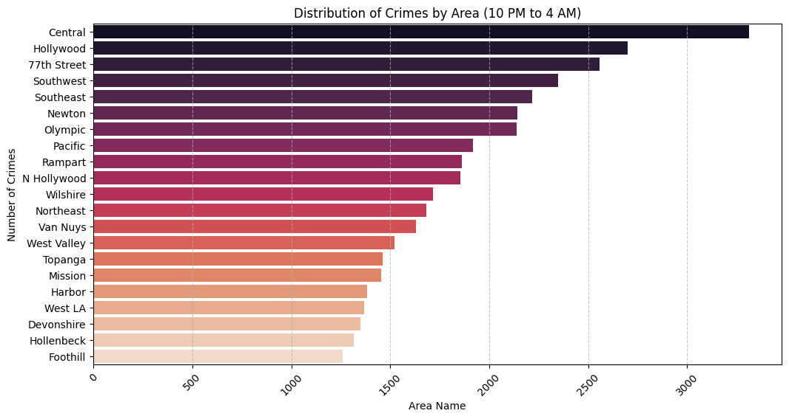
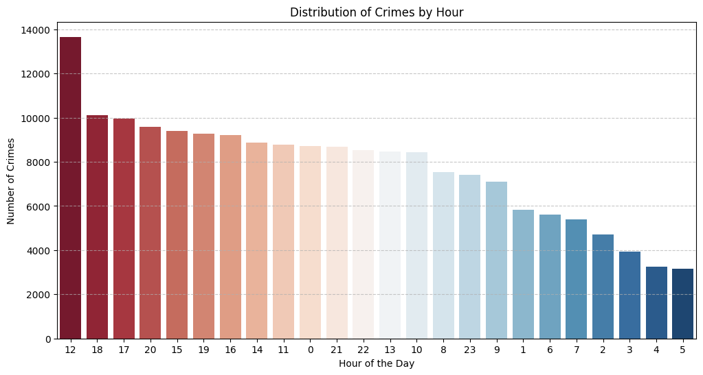
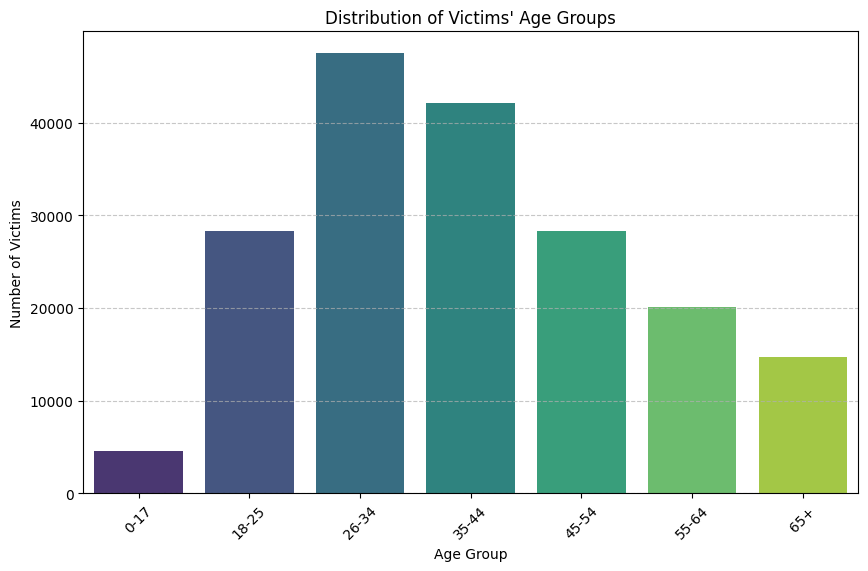

# 🏙️ Analyzing Crime in Los Angeles (LAPD Data)



## 📌 Project Overview
Los Angeles, the "City of Angels," is one of the most populated cities in the world. With high population density comes complex public safety challenges. This project analyzes a modified dataset from **Los Angeles Open Data** to identify patterns in criminal behavior. The goal is to assist the **LAPD** in resource allocation by pinpointing peak crime times, dangerous areas during night shifts, and vulnerable age demographics.

## 📊 Executive Summary
The analysis was performed on over **185,000 crime records**. The study revealed that crime peaks during the middle of the day, specifically at **12:00 PM**. Geographically, the **Central** area remains the most dangerous hotspot during late-night hours (10 PM – 4 AM). Demographically, individuals aged **26–44** represent the largest group of victims, suggesting a need for targeted safety awareness in professional and social settings.

## ❓ Key Business Questions Answered
1.  **Which hour has the highest frequency of crimes?**
    * **Result:** The 12th hour (12:00 PM) saw the highest activity with **13,663** incidents.
2.  **Which area has the largest frequency of night crimes (10 PM to 4 AM)?**
    * **Result:** The **Central** area is the primary hotspot with **3,312** night crimes.
3.  **What is the distribution of crimes across victim age groups?**
    * **Result:** The **26–34** age group is the most targeted demographic, followed closely by the **35–44** bracket.

## 🛠️ Tech Stack & Tools
* **Language:** Python 3.13
* **Data Manipulation:** `Pandas`, `NumPy`
* **Visualization:** `Matplotlib`, `Seaborn`
* **Environment:** Jupyter Notebook / VS Code

## ⚙️ The Data Process
1.  **Data Loading:** Imported the `crimes.csv` dataset containing details like time, area, victim age, and crime description.
2.  **Data Inspection:** Checked for null values and data types; noted significant missing values in the `Weapon Desc` column.
3.  **Feature Engineering:** Extracted the **hour** from military time (`TIME OCC`) to facilitate time-series analysis.
4.  **Binned Analysis:** Created age categories (bins) to group victims from "0-17" to "65+" for demographic insights.
5.  **Visualization:** Utilized `Seaborn` color palettes like *RdBu*, *rocket*, and *viridis* to create professional, readable charts.

## 💡 Key Insights & Results
* **The Noon Spike:** There is a distinct spike in reported crimes at midday, likely due to increased human activity and reporting.

* **Central Night Activity:** Law enforcement should prioritize patrols in the **Central** area specifically between 10 PM and 4 AM.

* **Demographic Vulnerability:** While children (0-17) have the lowest victim counts, young to middle-aged adults (26-44) account for nearly **50%** of all victims.


## ⚠️ Challenges & Solutions
* **Challenge:** Handling military time in an integer format for analysis.
* **Solution:** Used integer division (`// 100`) to effectively isolate the hour of the day from the `TIME OCC` column.
* **Challenge:** Analyzing raw ages which produced a messy distribution.
* **Solution:** Implemented `pd.cut` to bin ages into logical groups, providing a clearer categorical overview.

## 🏁 Conclusion
The analysis successfully identifies the "Who, When, and Where" of crime in Los Angeles. By focusing on midday crime reporting and night-time security in the Central district, the LAPD can strategically improve public safety.

## 🚀 How to Run This Project
1.  Clone the repository:
    ```bash
    git clone [https://github.com/your-username/la-crime-analysis.git](https://github.com/your-username/la-crime-analysis.git)
    ```
2.  Install dependencies:
    ```bash
    pip install pandas numpy matplotlib seaborn
    ```
3.  Ensure `crimes.csv` and `la_skyline.jpg` are in the project folder.
4.  Run the notebook:
    ```bash
    jupyter notebook Los_Angeles_crime_analysis.ipynb
    ```

## 👤 About the Author
**Haseeb**
*Freelance Data Analyst*

I am a passionate data analyst dedicated to deriving actionable insights from complex datasets. My expertise lies in Python, SQL, Excel, and Data Visualization.

*   **LinkedIn:** [Haseeb Uddin](https://www.linkedin.com/in/haseeb-uddin-q/)
